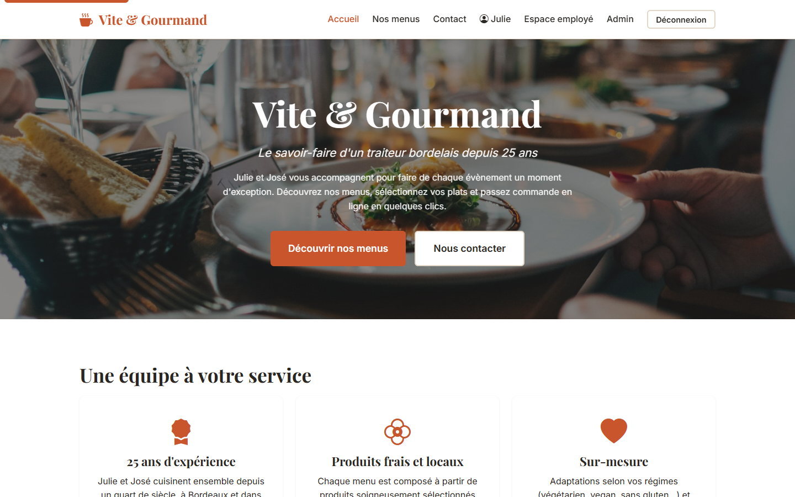
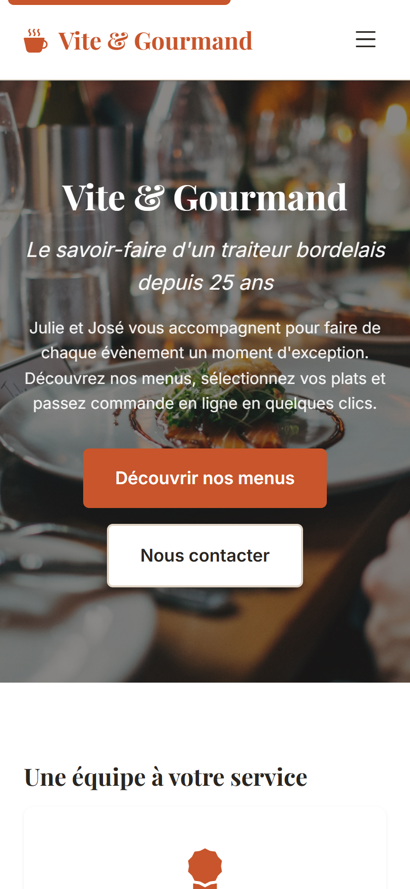
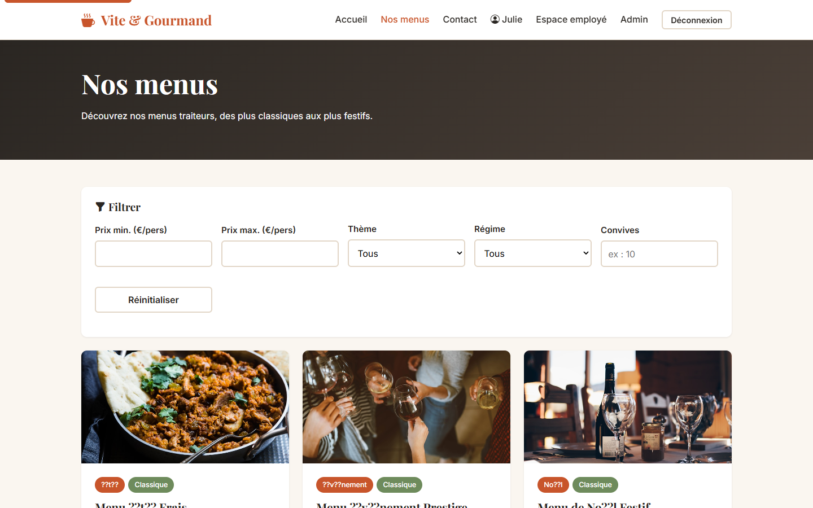
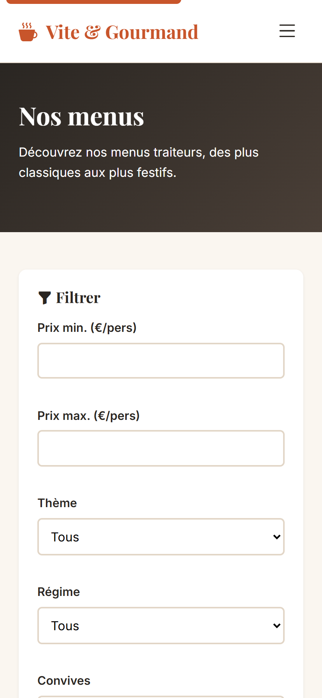
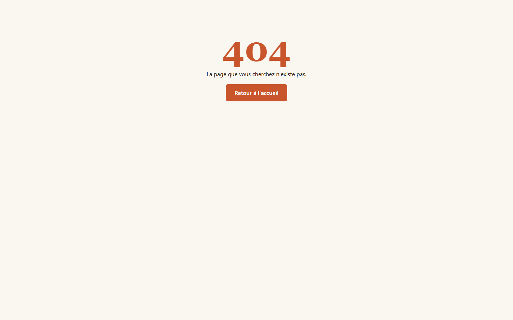
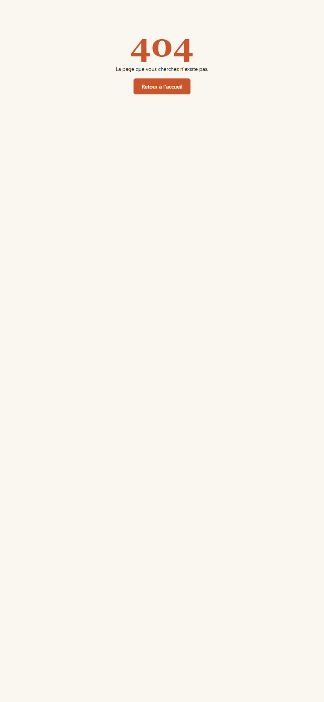
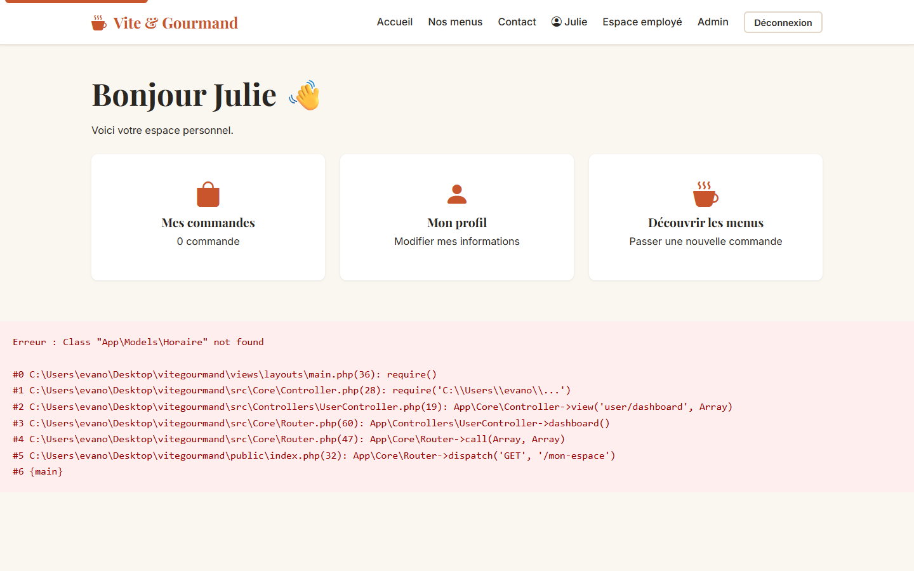
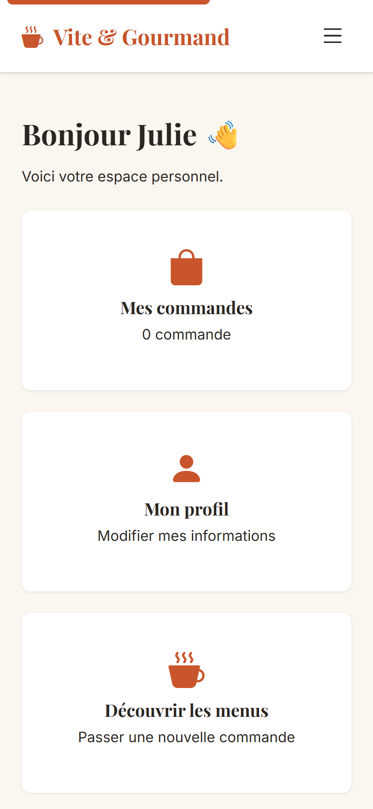
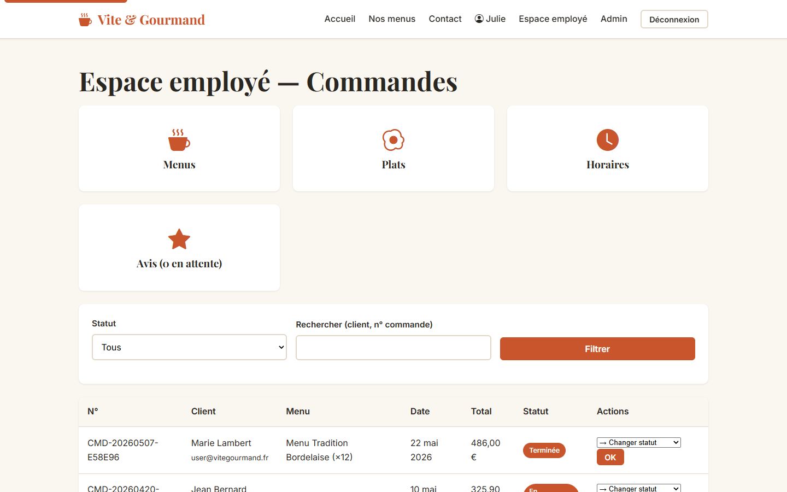
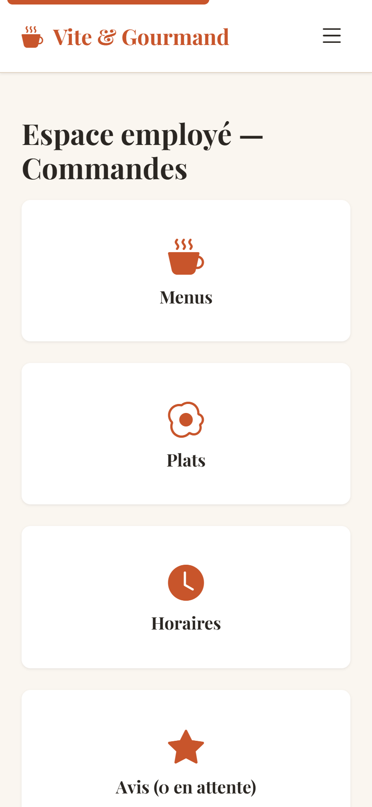

# Maquettes — Vite & Gourmand

Maquettes **haute fidélité** générées via Puppeteer (script `tools/screenshots.cjs`).
Toutes les pages sont capturées en **desktop (1440×900)** et **mobile (414×896)**.

## 1. Page d'accueil

### Desktop


### Mobile


---

## 2. Liste des menus avec filtres

### Desktop


### Mobile


---

## 3. Détail d'un menu

### Desktop


### Mobile


---

## 4. Page de connexion

### Desktop


### Mobile


---

## 5. Création de compte

### Desktop


### Mobile


---

## 6. Espace employé

### Desktop


### Mobile


---

## Reproduire ces captures

```bash
# Démarrer le serveur PHP local
php -S localhost:8001 -t public

# Dans un autre terminal
node tools/screenshots.cjs http://localhost:8001
```

Les captures sont régénérées dans `docs/maquettes/img/`.
