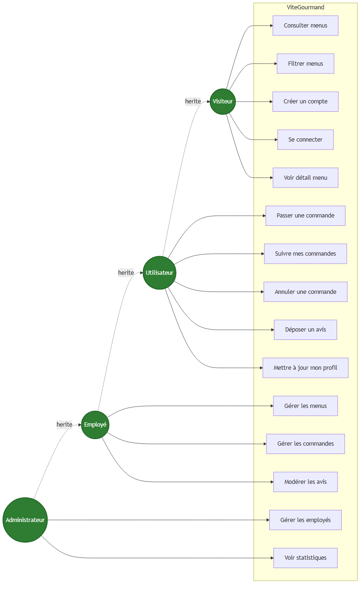

# Diagramme de cas d'utilisation — Vite & Gourmand

> Source : [`use-case.mmd`](use-case.mmd) — généré via Mermaid CLI.

## Acteurs et relations d'héritage

| Acteur | Hérite de | Description |
|--------|-----------|-------------|
| **Visiteur** | — | Utilisateur non authentifié |
| **Utilisateur** | Visiteur | Client ayant créé un compte |
| **Employé** | Utilisateur | Gère menus, plats, horaires, commandes, avis |
| **Administrateur** | Employé | Crée les employés, voit les statistiques |

## Cas d'utilisation détaillés

### Visiteur
- **Consulter les menus** : liste des menus proposés par le traiteur
- **Filtrer les menus** : par thème, régime, prix
- **Créer un compte** : email, mot de passe robuste (10 car, maj/min/chiffre/spécial), adresse, téléphone
- **Se connecter** : authentification
- **Voir détail menu** : description, plats, allergènes, prix

### Utilisateur (étend Visiteur)
- **Passer une commande** : choisir menu + nombre de personnes + adresse + date prestation
- **Suivre mes commandes** : voir l'historique et le statut en cours
- **Annuler une commande** : tant qu'elle est en `acceptee` ou `en_attente`
- **Déposer un avis** : après statut `terminee`, note 1-5 + commentaire
- **Mettre à jour mon profil** : adresse, téléphone, mot de passe

### Employé (étend Utilisateur)
- **Gérer les menus** : CRUD complet (titre, plats, prix, thème, régime, photos)
- **Gérer les commandes** : changer statut (en_preparation → livraison → livré → terminée)
- **Modérer les avis** : valider / refuser un avis avant publication

### Administrateur (étend Employé)
- **Gérer les employés** : créer / désactiver un compte employé
- **Voir statistiques** : commandes par menu, chiffre d'affaires par période (graphiques Chart.js)
